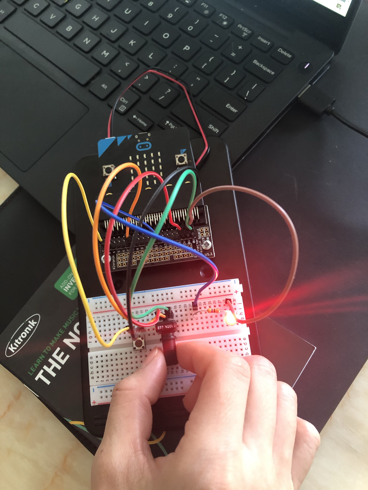
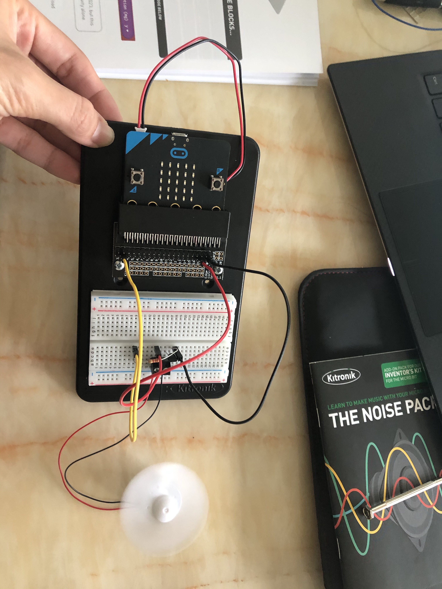

# Inventor Kit Experiments

*Markdown reference: https://guides.github.com/features/mastering-markdown/*

## Instructions ##

*For a selection of 5 inventor kit experiments that you choose, fill out the following sections.

### SAY "HELLO" TO THE BBC micro:bit! ###

#### Photo of completed project ####
*In the code below, replace `missingimage.png` with the name of the image, which should be in the `kitexperiments` folder.*

(This is my first experiment.)

#### Reflection ####

In this experiment, everything to me was new. It was my first time get to know microbit.

This experiment could be the basis of a real world application such as simple toys for babys.

### USING A LIGHT SENSOR & ANALOG INPUTS ###

#### Photo of completed project ####
In the code below, replace imagemissing.jpg with the name of the image, which should be in the kitexperiments folder.

(This is my second experiment.)

#### Reflection ####

In this experiment, something new to me was or something I learned was light sensor and ananlog inputs.

This experiment could be the basis of a real world application such as sensor light in corridor or doorway and toys.

### DIMMING AN LED USING A POTENTIOMETER ###

(Replace this with the experiment name)

#### Photo of completed project ####
In the code below, replace imagemissing.jpg with the name of the image, which should be in the kitexperiments folder.

(This is my third experiment.)

#### Reflection ####

In this experiment, something new to me was or something I learned was potentiometer.

This experiment could be the basis of a real world application such as fans, lights and toys.

### USING A TRANSISITOR TO DRIVE A MOTOR ###

#### Photo of completed project ####
In the code below, replace imagemissing.jpg with the name of the image, which should be in the kitexperiments folder.

(This is my forth experiment.)

#### Reflection ####

In this experiment, something new to me was or something I learned was (insert something here).

This experiment could be the basis of a real world application such as (insert something here).

### USING THE ACCELEROMETER TO CONTROL MOTOR SPEED ###

(Replace this with the experiment name)

#### Photo of completed project ####
In the code below, replace imagemissing.jpg with the name of the image, which should be in the kitexperiments folder.

(This is my fifth experiment.)

#### Reflection ####

In this experiment, something new to me was or something I learned was (insert something here).

This experiment could be the basis of a real world application such as (insert something here).

