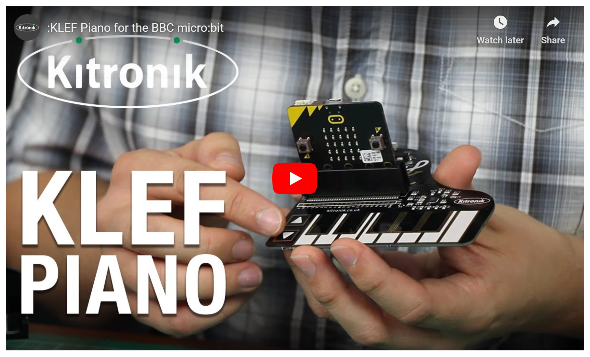
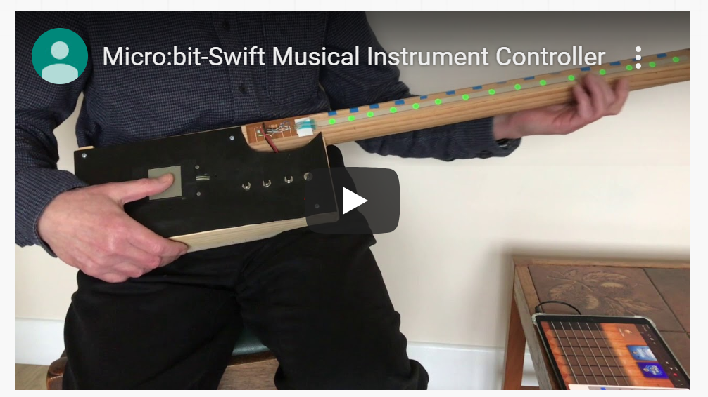
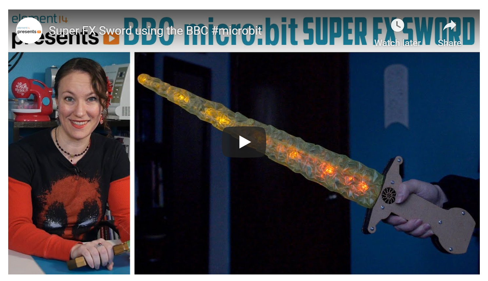
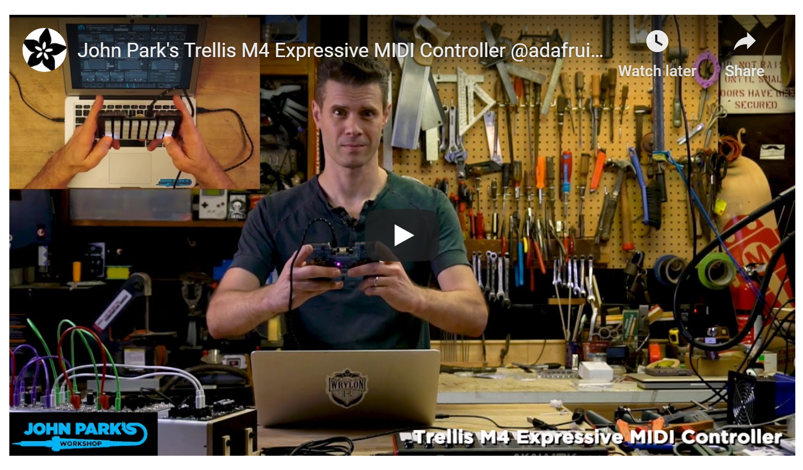
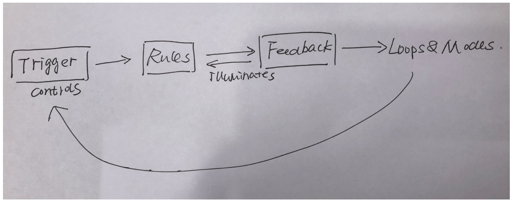

# Assessment 1: Replication project

*Fill out the following workbook with information relevant to your project.*

*Markdown reference:* [https://guides.github.com/features/mastering-markdown/](http://guides.github.com/features/mastering-markdown/)

## Guitar ##

## Related projects ##
*Find about 6 related projects to the project you choose. A project might be related through  function, technology, materials, fabrication, concept, or code. Don't forget to place an image of the related project in the* `replicationproject` *folder and insert the filename in the appropriate places below. Copy the markdown block of code below for each project you are showing, updating the number* `1` *in the subtitle for each.*

### Related project 1 KLEF Piano for the BBC micro:bit ###

https://www.youtube.com/watch?v=waFRn0v0bpE

This project is related to mine because I think the touch board used in project are similar. And the principle is similar as well. I also used noisy pack in my project.

### Related project 2 Micro:bit-Swift Musical Instrument Controller ###

https://www.youtube.com/watch?v=Jflf77bLC34&t=38s

This project is related to mine because I think we have the same concept that "makes the Micro:bit an ideal and cheap way to build interfaces".

### Related project 3 Super FX Sword using the BBC  ###

https://www.youtube.com/watch?v=u9lKilq6tr0

This project is related to mine because this project is similar to my original concept of making guitars, and uses acceleration to control the change of sound. Although it has nothing to do with what I want to do, it is shared here because it inspired me.

### Related project 4 Adafruit Trellis M4 MIDI controller tilt mod wheel demo  ###

https://learn.adafruit.com/trellis-m4-midi-keypad-and-tilt-controller/overview

This project is related to mine because this project is similar to my original concept of making guitars, and uses acceleration to control the change of sound. Although it has nothing to do with what I want to do, it is shared here because it inspired me.

## Reading reflections ##
*Reflective reading is an important part of actually making your reading worthwhile. Don't just read the words to understand what they say: read to see how the ideas in the text fit with and potentially change your existing knowledge and maybe even conceptual frameworks. We assume you can basically figure out what the readings mean, but the more important process is to understand how that changes what you think, particularly in the context of your project.*

*For each of the assigned readings, answer the questions below.*

### Reading: Don Norman, The Design of Everyday Things, Chapter 1 (The Psychopathology of Everyday Things) ###

I have never been exposed to these terms, and when I was going to read them at first, I thought this article would be very difficult to understand. The five words affordabilitys, signifiers, mappings, and feedback are nothing more than affordability in my opinion. Semaphores are objects that give signals, maps, and customer feedback. But after reading this chapter, I found that they are not just What I understand, there is a deeper meaning and the inextricable connection between them. 

First, through the author's introduction, I understood the good design from the four aspects of affordances, signifiers, mappings, and feedback. I also understand the meaning of affordances, signifiers, mappings, and feedback, and I also understand the relationship between the four of them. Affordances means how the object could possibly be used, and affordances are divided into Perceived affordances and visible affordances. The author describes his argument with his friend Gibson in the text to illustrate "Perceived affordances help people figure out what actions are possible without the need for labels or instructions ".
The signifiers are a way of communicating where the touch should be, which is equivalent to clue. In this part, the author classifies the signifiers. Some signifiers are simply the perceived affordances, while the other parts are misleading signifiers. Speaking of affordances, signifiers, Affordances represent the possibilities in the world for how an agent, maybe a person, animal, or machine, can interact with something. Some affordances are perceivable, others are invisible. Signifiers are signals. Mapping is an important concept in the design and layout of controls and displays. Mappings are also roughly divided into two categories. One is natural mappings are cultural or biological, Other natural mappings follow from the principles of perception and allow for the natural grouping or patterning of controls and feedback. Feedback is better understood for me, that is, customers use feedback. The speed of customer feedback also shows that the design is unsuccessful, because if the customer gives feedback for too long, it is easy for the customer to give up and continue using. Too much feedback can be irritating. Therefore, Feedback is essential, but not when it gets in the way of other things, the environment must also be comfortable. essential, but it has to be done correctly and apropriately.
The main clues of how things work come from their perceived structure, especially the four aspects of affordances, signifiers, mappings, and feedback.

After reading this chapter, I would like to further understand how these four interact specifically, because for a designer, it's not just about designing an item. As far as my project is concerned, after reading this chapter, I will pay more attention to looking at or examining my project from these four aspects.

### Reading: Chapter 1 of Dan Saffer, Microinteractions: Designing with Details, Chapter 1 ###

When I saw the author quoting "Nothing big works." —Victor Papanek "at the beginning, I was thinking that this book must be talking about small things, although they are small but great.

After reading this chapter, I still learned a lot of knowledge. For a Chinese, this is not just an expansion of the vocabulary. The author analyzes one by one how to distinguish microinteractions from features, and dive into the structure of microinteractions, which also forms the structure of it, by citing the outdated alarm clock of the Patron X iPhone. To me, this is all new knowledge. I have never touched this area before, but after reading this chapter, I first learned that microinteractions and features are different in size and scope. Microinteractions are included in features. Secondly, I summarized several features of microinteractions from the article:
1. Microinteractions can make = a whole or a small part of the design
2. Microinteractions are often the last part of the design process, and as such they are often overlooked.
3. Microinteractions do n’t matter as much is most early stage technology, when people are more amazed something can be done rather than how it ’s done
4. In competitive markets, microinteractions are very important, and the overall experience of a product relies heavily on its microinteractions.
5. Microinteractions are the glue that can tie together features across mobile devices, for example, TV, desktop and laptop computers, appliances, and the Web. Although microinteractions may vary from platform to platform, their small size can achieve large No consistency in function.
6. Micro-interactions are also very suitable for our already crowded, too complicated and fragmented life. As a result, microinteractions force designers to simply work and focus on details. Just like interactions, microinteractions also have their own structure. I drew a flowchart to show my understanding of its structure.

In the end, I also learned how to make a good design. That is to be meticulous no matter which part is treated. The author also summarized three ways, that is, "look for them and focus on each individually, reduce a complicated feature to a core microinteraction, or treat every feature as a set of linked microinteractions". Therefore, a good design is required Constant efforts to improve.

After reading this chapter, I am actually more interested in the specific content of the three methods. Learn more about how these three ways make me understand better about  Microinteractions. After reading this chapter, I gained a new understanding of the flow chart for drawing my own project. Just like the microinteractions structure, you can clearly see your design ideas and not be misled by tedious and complicated processes.

### Reading: Scott Sullivan, Prototyping Interactive Objects ###

Prior to that, I had never been exposed to Prototyping. When I looked up the word in the dictionary, I had a preliminary understanding. Prototyping is a preliminary model to test a concept, which reminds me of the cardboard model we made before. But this is not the case. Here, Prototyping refers to the method applied in the field of digital products.
After reading this chapter, I think that I have gained more than just knowledge, but also the author's encouragement to designers, no matter in which field, the designers, so that I have more courage to accept to learn new Technical methods or new fields. I have a preliminary understanding of the two tools PROCESSING AND ARDUINO. Processing evolved into a development tool for professionals. When designers are learning very abstract theories, it makes coding appear more intuitively to designers. ARDUINO is not only a platform, but also a programming language. It can also be displayed on a computer or actuator through a simple electrical signal.
I actually want to know more about PROCESSING AND ARDUINO and cases, because after reading this chapter, it is still a bit difficult to understand.
I think this chapter has a lot of very difficult knowledge, which is very abstract for me. The inspiration that the author brings to me is more important than it will be. The author describes his own case CAPYBARA in this chapter, and the implementation process is difficult, as the author himself said in the book, all this is prohibitive. But before we came into contact with new technologies or methods, everything seemed terrible, just like I started this course, everything seemed a mess, but when I slowly started to contact it, I found it fun.

## Interaction flowchart ##
*Draw a flowchart of the interaction process in your project. Make sure you think about all the stages of interaction step-by-step. Also make sure that you consider actions a user might take that aren't what you intend in an ideal use case. Insert an image of it below. It might just be a photo of a hand-drawn sketch, not a carefully drawn digital diagram. It just needs to be legible.*

## Process documentation

*In this section, include text and images that represent the development of your project including sources you've found (URLs and written references), choices you've made, sketches you've done, iterations completed, materials you've investigated, and code samples. Use the markdown reference for help in formatting the material.*

*This should have quite a lot of information!*

*There will likely by a dozen or so images of the project under construction. The images should help explain why you've made the choices you've made as well as what you have done. Use the code below to include images, and copy it for each image, updating the information for each.*

*Include screenshots of the code you have used.*

## Project outcome ##

*Complete the following information.*

### Project title ###

### Project description ###

*In a few sentences, describe what the project is and does, who it is for, and a typical use case.*

### Showcase image ###

*Try to capture the image as if it were in a portfolio, sales material, or project proposal. The project isn't likely to be something that finished, but practice making images that capture the project in that style.*

### Additional view ###

*Provide some other image that gives a viewer a different perspective on the project such as more about how it functions, the project in use, or something else.*

### Reflection ###

*Describe the parts of your project you felt were most successful and the parts that could have done with improvement, whether in terms of outcome, process, or understanding.*

*What techniques, approaches, skills, or information did you find useful from other sources (such as the related projects you identified earlier)?*

*What ideas have you read, heard, or seen that informed your thinking on this project? (Provide references.)*

*What might be an interesting extension of this project? In what other contexts might this project be used?*
